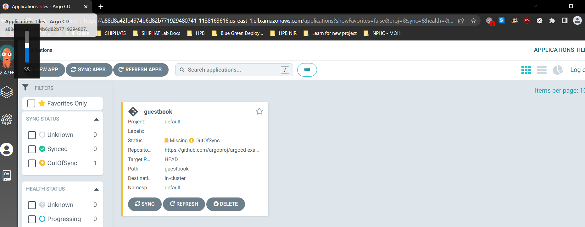
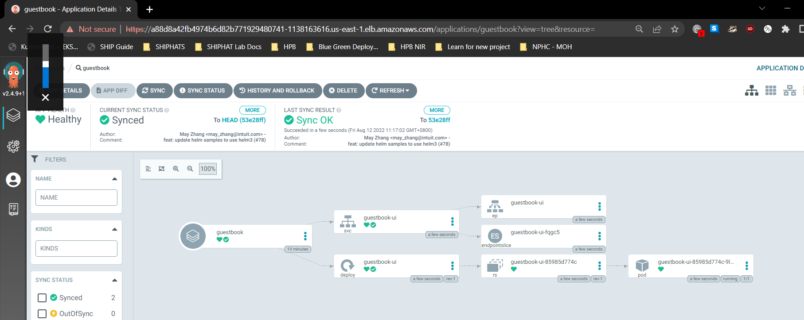

## Trying out argocd 

build neccessary aws resources using these [terraform scripts](https://github.com/jasonltr/eks-blue-green/tree/master/infra)  
cd to infra and run  
`terraform init`  
`terraform fmt -recursive`
`terraform validate`  
`terraform state rm module.eks.kubernetes_config_map.aws_auth` (this removes previous kubeconfig, i think)  
`terraform plan`  
`terraform apply -auto-approve`  

Wait awhile for resources to be built  
Add the cluster to kube config  
`aws eks update-kubeconfig         --name eks-blue-green         --region us-east-1`  
  
Then follow this argoCD [tutorial](https://argo-cd.readthedocs.io/en/stable/getting_started/)  
Recommended to use CLI, then verify on argocd UI
```
kubectl create namespace argocd
kubectl apply -n argocd -f https://raw.githubusercontent.com/argoproj/argo-cd/stable/manifests/install.yaml
```
```
brew install argocd
```
```
kubectl patch svc argocd-server -n argocd -p '{"spec": {"type": "LoadBalancer"}}'
```
username is admin get password using `kubectl -n argocd get secret argocd-initial-admin-secret -o jsonpath="{.data.password}" | base64 -d; echo`  
Get the external IP using `ubectl get all --namespace argocd -o=wide`  
```
service/argocd-server                             LoadBalancer   172.20.107.37    a88d8a42fb4974b6d82b771929480741-1138163616.us-east-1.elb.amazonaws.com   80:31523/TCP,443:32134/TCP   18m   app.kubernetes.io/name=argocd-server
```
  
login via cli using  
`argocd login <ARGOCD_SERVER>`  
create an app using  
`argocd app create guestbook --repo https://github.com/argoproj/argocd-example-apps.git --path guestbook --dest-server https://kubernetes.default.svc --dest-namespace default`  
verify on UI and `argocd app get guestbook`  
 
```
The application status is initially in OutOfSync state since the application has yet to be deployed, and no Kubernetes resources have been created. To sync (deploy) the application, run:
```
run `argocd app sync guestbook`  
This command retrieves the manifests from the repository and performs a kubectl apply of the manifests. The guestbook app is now running and you can now view its resource components, logs, events, and assessed health status.  
```
Name:               guestbook
Project:            default
Server:             https://kubernetes.default.svc
Namespace:          default
URL:                https://a88d8a42fb4974b6d82b771929480741-1138163616.us-east-1.elb.amazonaws.com/applications/guestbook
Repo:               https://github.com/argoproj/argocd-example-apps.git
Target:             HEAD
Path:               guestbook
SyncWindow:         Sync Allowed
Sync Policy:        <none>
Sync Status:        Synced to HEAD (53e28ff)
Health Status:      Progressing

Operation:          Sync
Sync Revision:      53e28ff20cc530b9ada2173fbbd64d48338583ba
Phase:              Succeeded
Start:              2022-08-12 11:17:01 +0800 +08
Finished:           2022-08-12 11:17:02 +0800 +08
Duration:           1s
Message:            successfully synced (all tasks run)

GROUP  KIND        NAMESPACE  NAME          STATUS  HEALTH       HOOK  MESSAGE
       Service     default    guestbook-ui  Synced  Healthy            service/guestbook-ui created
apps   Deployment  default    guestbook-ui  Synced  Progressing        deployment.apps/guestbook-ui created
```
 
check using `kubectl get all --namespace default -o=wide`
```
jason@DEV-52WP6M3:~/Documents/eks-blue-green/infra$ kubectl get all --namespace default -o=wide
NAME                                READY   STATUS    RESTARTS   AGE     IP          NODE                        NOMINATED NODE   READINESS GATES
pod/guestbook-ui-85985d774c-9l7jq   1/1     Running   0          2m21s   10.0.2.66   ip-10-0-2-34.ec2.internal   <none>           <none>

NAME                   TYPE        CLUSTER-IP     EXTERNAL-IP   PORT(S)   AGE     SELECTOR
service/guestbook-ui   ClusterIP   172.20.73.77   <none>        80/TCP    2m23s   app=guestbook-ui
service/kubernetes     ClusterIP   172.20.0.1     <none>        443/TCP   36m     <none>

NAME                           READY   UP-TO-DATE   AVAILABLE   AGE     CONTAINERS     IMAGES                                       SELECTOR
deployment.apps/guestbook-ui   1/1     1            1           2m24s   guestbook-ui   gcr.io/heptio-images/ks-guestbook-demo:0.2   app=guestbook-ui

NAME                                      DESIRED   CURRENT   READY   AGE     CONTAINERS     IMAGES                                       SELECTOR
replicaset.apps/guestbook-ui-85985d774c   1         1         1       2m25s   guestbook-ui   gcr.io/heptio-images/ks-guestbook-demo:0.2   app=guestbook-ui,pod-template-hash=85985d774c
```